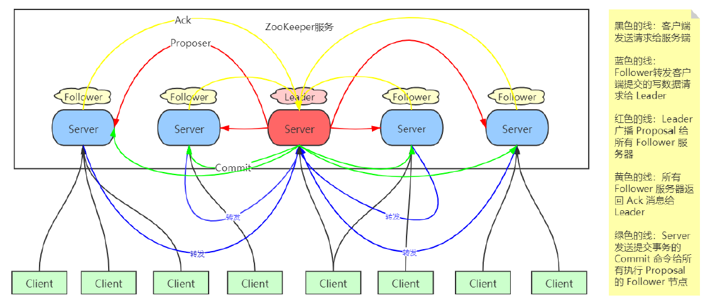
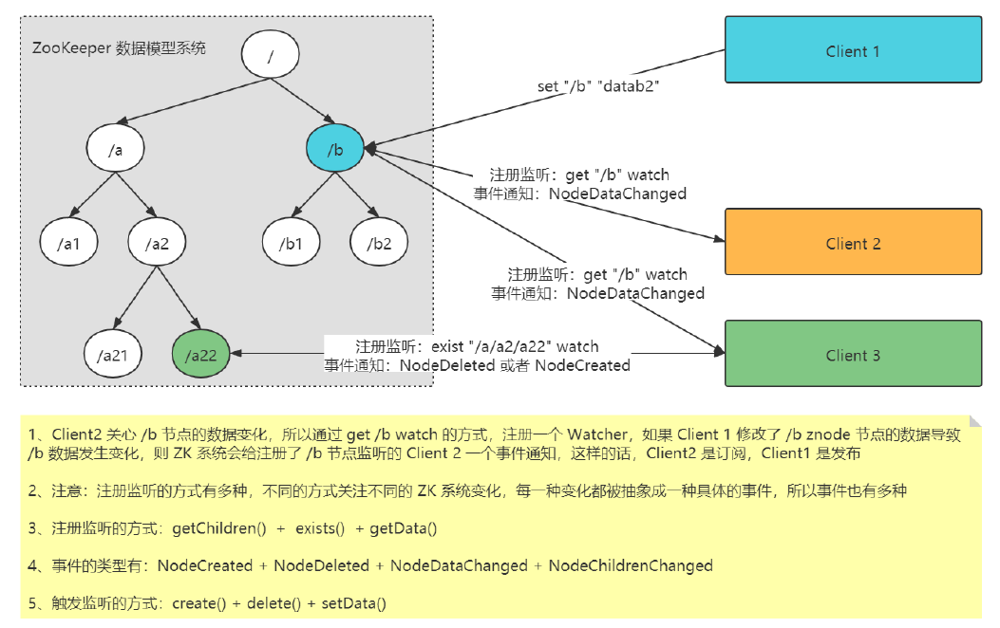

## zookeeper核心功能和工作机制.md

### 1. zk架构深入理解
ZooKeeper 是一个分布式协调服务，劝架者，仲裁机构。 多个节点如果出现了意见的不一致，需要一个中间机构来调停！
> 对于分布式计算来说，节点挂掉、读写冲突（不一致）这些问题需要有人来协调处理，还有别的场景问题吗？

ZooKeeper 就是一个小型的议会！当分布式系统中的多个节点，如果出现不一致，则把这个不一致的情况往 ZooKeeper 中写。ZooKeeper 会给你返回写成功的响
应。但凡你接收到成功的响应，意味着 ZooKeeper 帮你达成了一致！

ZooKeeper 以一个集群的方式对外提供协调服务，**集群内部的所有节点都保存了一份完整的数据**。其中一个主节点用来做集群管理提供写数据服务，其他的从节点
用来同步数据，提供读数据服务。这些从节点必须保持和主节点的数据状态一致。



1. ZooKeeper 是对等架构，工作的时候，会举行选举，变成 Leader + Follower 架构
2. 在 ZooKeeper 中，没有沿用 Master/Slave(主备)概念，而是引入了 Leader、Follower、Observer 三种角色概念。通过 Leader 选举算法来选定一台服务器充
   当 Leader 节点，Leader 机器为客户端提供读写服务，其他角色，也就是 Follower 提供读服务，在提供读服务的 Follower 和 Observer 中，唯一区别就是
   Observer 不参与 Leader 选举过程，没有选举权和被选举权，因此 **Observer 的作用就是可以在不影响写性能情况下提高集群读性能**。
3. ZooKeeper 系统还有一种角色叫做 Observer，Observer 和 Follower 最大的区别就是 Observer 除了没有选举权 和 被选举权 以外，其他的和 Follower 完全
   一样
4. ZooKeeper 系统的 Leader 就相当于是一个全局唯一的分布式事务发起者，其他所有的 Follower 是事务参与者，拥有投票权
5. ZooKeeper 集群的最佳配置：比如 5,7,9,11,13 个这样的总结点数，Observer 若干，Observer 最好是在需要提升 ZooKeeper 集群服务能力的再进行扩展，而
   不是一开始就设置 Observer 角色！Follower 切记不宜太多！
6. Observer 的作用是 分担整个集群的读数据压力，同时又不增加分布式事务的执行压力，因为分布式事务的执行操作，只会在 Leader 和 Follower 中执行。
   Observer 只是保持跟 Leader 的同步，然后帮忙对外提供读数据服务，从而减轻 ZooKeeper 的数据读取服务压力。
7. ZooKeeper 中的所有数据，都在所有节点保存了一份完整的。所以只要所有节点保持状态一致的话，肯定是所有节点都可以单独对外提供读服务的。
8. ZooKeeper 集群中的所有节点的数据状态通过 ZAB 协议保持一致。ZAB 有两种工作模式：
   1. 崩溃恢复：集群没有 Leader 角色，内部在执行选举
   2. 原子广播：集群有 Leader 角色，Leader 主导分布式事务的执行，向所有的 Follower 节点，按照严格顺序广播事务
   3. 补充一点：实际上，ZAB 有四种工作模式，分别是：ELECTION，DISCOVERY，SYNCHRONIZATION，BROADCAST
9. ZooKeeper 系统中的 Leader 角色可以进行读，写操作，Follower 角色可以进行读操作执行，但是接收到写操作，会转发给 Leader 去执行。ZooKeeper 的所
   有事务操作在 Zookeeper 系统内部都是严格有序串行执行的。
10. ZooKeeper 系统虽然提供了存储系统（类文件系统：树形结构，每个节点不是文件也不是文件夹，是一个 znode ），但是这个存储，只是为自己实现某些功能
    做准备的，而不是提供出来，给用户存储大量数据的，所以，切忌往 ZooKeeper 中存储大量数据，甚至每个 Znode 节点的数据存储大小不能超过 1M
11. ZooKeeper 提供了 znode 节点的常规的增删改查操作，使用这些操作，可以模拟对应的业务操作，使用监听机制，可以让客户端立即感知这种变化。
12. ZooKeeper 集群和其他分布式集群最大的不同，在于 ZooKeeper 是不能进行线性扩展的。因为像 HDFS 的集群服务能力是和集群的节点个数成正比，但是
    ZooKeeper 系统的节点个数到一定程度之后，节点数越多，反而性能越差。
13. ZooKeeper 实现了 A可用性、P分区容错性、C中的写入强一致性，丧失的是C中的读取一致性。ZooKeeper 并不保证读取的是最新数据。如果客户端刚好链接
    到一个刚好没执行事务成功的节点，也就是说没和 Leader 保持一致的 Follower 节点的话，是有可能读取到非最新数据的。如果要保证读取到最新数据，请使
    用 sync 回调处理。这个机制的原理：是先让 Follower 保持和 Leader 一致，然后再返回结果给客户端。
14. Leader 的内部，有三个服务端！
  - 对 Follower 和 Observer 提供服务的
  - 为 Client 服务的
  - 给选举服务

### 2. ZNode数据模型
ZooKeeper 内部提供了一个数据存储系统，ZNode 数据模型是一个类 FileSystem 文件系统（为什么叫做类文件系统呢？因为正常文件系统中的每个节点要么是
directory 要么是 file，但是 znode 数据模型中的节点，没有这种区分，只有一个统一的概念，叫做 znode，但是既能存储数据，也能挂载子节点。所以既是文件
夹，也是文件）

**总结：ZooKeeper 的数据模型系统是一个类文件系统结构，每个节点称之为 ZNode，具体代码实现类是 DataNode，既不是文件夹，也不是文件，但是既具有文
件夹的能力，也具有文件的能力。**

#### 关于ZNode的理解：
1、ZNode 的约束（ZNode 的节点存储的最大数据是 1M，最好不要超过 1kb）为什么？ZNode 的深度没有约束
> 每个节点都有相同的数据视图：每个节点都存储了这个 ZooKeeper 中的所有数据，每个节点的数据状态都和 leader 保持一致
> - 同步的压力：写入过程至少要超过半数节点写成功才能认为该数据写成功，节点数越多，成功的难度越大（因为写请求需要在所有服务器节点进行原子广播）
> - 存储的压力：所有数据的规模超出单台服务器的存储能力
> - 所有请求都是严格按照顺序串行执行，同一时间只能执行一个事务，如果一个事务耗时，会阻塞后面请求的执行
> - zk的设计初衷，就不是为了给用户提供一个大规模数据存储服务，而是提供了一个为了解决一些分布式问题而需要**进行一些状态存储的数据模型系统。**

2、znode 的分类
```
1、按照生命周期：临时节点 EPHEMERAL 和 永久节点 PERSISTENT
    - 持久类型（显示创建，显示删除，只有当使用显示命令来删除节点，否则这个节点知道被创建成功，则会一直存在）
    - 临时类型/短暂类型（跟会话绑定，那个会话创建的这个节点，如果这个会话断开，则这个会话创建的所有临时节点被系统删除）。
    每个znode节点必然都是由某一个 session 创建的。如果当前这个 session 断开，那么该 znode 节点会被自动删除

    比如 HDFS ，Kafka，HBase, 等各种组件使用 ZooKeeper 的时候，都是先建立跟 ZooKeeper 的会话链接
    通过这个会话链接去创建一个 临时 znode 节点。如果这个链接断开，则 ZooKeeper 系统会自动删掉这个链接创建的所有临时节点
    
2、按照是否带序列编号分，可以分为带顺序编号，和不带顺序编号两种类型的几点。每个节点都各自维护了一个序列编号，当前节点的序列编号是由它的父节点维护的，
    编号是自增序列编号，和 MySQL 的自增主键是一样的道理
    1、带 /a0000000001,/a000000002
    2、不带 /a
    create /a "data"

总结起来就是分了4种：
    1、CreateMode.PERSISTENT 持久
    2、CreateMode.PERSISTENT_SEQUENTIAL 持久带序列编号
    3、CreateMode.EPHEMERAL 临时
    4、CreateMode.EPHEMERAL_SEQUENTIAL 临时带序列编
```
3、znode 的小知识
- 临时节点下面不能挂着子节点，由此只能作为叶子节点，临时节点的生命周期跟会话绑定
- 经典的用法：尽量少往 ZooKeeper 中写数据，写入的数据也不要特别大！ZooKeeper 只适合用来存储少量的关键数据！比如代表一个集群中到底谁是真正 active
  leader 的信息数据（比如hbase master以及hdfs）


### 3. watcher监听机制
ZooKeeper 提供了数据的发布订阅功能，多个订阅者（客户端）可同时监听某一特定主题对象（ZNode节点），当该主题对象的自身状态发生变化时（例如节点内
容发生变化，节点下的子节点列表发生个数变化），系统会主动通知订阅者。

ZooKeeper 采用 Watcher 机制实现了发布/订阅功能。该机制在被订阅者对象发生变化的时候会**异步**的通知客户端，因此客户端不必在 Watcher 注册后轮询阻塞，
从而减轻客户端的压力。

客户端首先将 Watcher 注册到服务器上，同时将 Watcher 对象保存在客户端的 Watch 管理器中，当 Zookeeper 服务端监听的数据状态发生变化时，服务端会首先
主动通知客户端，接着客户端的 Watch 管理器会触发相关 Watcher 来回调相应的处理逻辑，从而完成整体的数据发布/订阅流程。

监听器 Watcher 的定义：
```
// 监听器抽象
interface Watcher{
// 该方法就是接收到服务端事件通知的监听回调方法。参数 event 有三个信息：
// 1、KeeperState state zk链接的状态
// 2、String znodePath 发生事件的znode节点
// 3、EventType type 事件的类型
void process(WatchedEvent event) throw Execption;
}
```


**一个 Watch 事件是一个一次性的触发器**，当被设置了 Watch 的数据发生了改变的时候，则服务器将这个改变发送给设置了 Watch 的客户端，以便通知它们。
> zk没有取消注册的机制

#### ZooKeeper 的监听机制的工作原理：


客户端中，还存在一个 WatchManager 管理服务： 当前这个客户端到底注册了那些节点的那些监听都被分门别类的进行了管理。当这个客户端接收到 ZooKeeper
系统的事件通知：WatchedEvent， 那么 WatchManager 就会根据这个事件对象内部的 znodePath + type + state 来确定后续操作是什么。

#### 监听机制的具体使用上
1、注册监听的方式
```
zk.getData(znodePath, watcher);     // 关注节点的数据变化
zk.exists(znodePath, watcher);      // 关注节点的存在与否的状态变化
zk.getChildren(znodePath, watcher); // 关注节点的子节点个数变化
```
2、触发监听的方式
```
zk.setData()        // 更改数据，触发监听 zk.getData()
zk.create()         // 创建节点，触发监听
zk.delete()         // 删除节点
```
3、事件的类型有4种
```
NodeCreated // 节点被创建
NodeDeleted // 节点被删除
NodeDataChanged // 节点数据发生改变
NodeChildrenChanged // 节点的子节点个数发生改变
None
```
汇总一下，就是如下这张图：


```
zk1客户端注册监听：
    zk1.getChildren("/xxx/parent", watcher) ==> 客户端 zk1 通过 getChildren 注册了一个监听： "/xxx/parent" 的子节点个数变化

zk2客户端执行操作，触发监听：
    zk2.setData("/xxx/parent", "newdata") ==> 触发客户端 zk1 就会收到 NodeDataChanged 事件
    zk2.createNode("/xxx/parent/son1") ==> 触发客户端 zk1 接收到 NodeChildrenChanged
    zk2.deleteNode("/xxx/parent/son2") ==> 触发客户端 zk1 接收到 NodeChildrenChanged
    zk2.setData("/xxx/parent/son2", "newData") ==> 触发客户端 zk1 不会收到通知。通知监听了 /xxx/parent/son2 的客户端
```